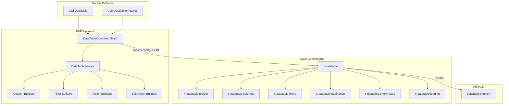
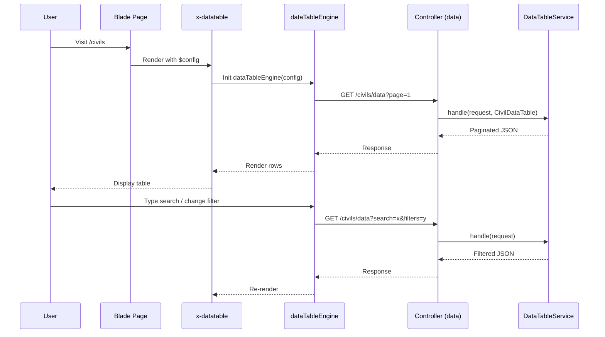

# Architecture: Reusable DataTable List Component

## Project Analysis

### Existing Tech Stack
| Layer | Technology |
|-------|-----------|
| CSS Framework | **Tailwind CSS v4** (via `@tailwindcss/vite`) |
| JS Framework | **Alpine.js 3** (global via `window.Alpine`) |
| Backend | **Laravel 12** (Blade, Eloquent) |
| Build Tool | Vite 7 |
| UI Library | Popper.js, Flatpickr, ApexCharts |

### Existing UI Components (to reuse)
| Component | Path |
|-----------|------|
| Modal | `components/ui/modal.blade.php` |
| Badge | `components/ui/badge.blade.php` |
| Button | `components/ui/button.blade.php` |
| Alert | `components/ui/alert.blade.php` |
| Data Grid (wrapper) | `components/tables/data-grid.blade.php` |
| Table Dropdown | `components/common/table-dropdown.blade.php` |
| Page Breadcrumb | `components/common/page-breadcrumb.blade.php` |
| Date Picker | `components/form/date-picker.blade.php` |
| Radio | `components/form/input/radio.blade.php` |
| Multi Select | `components/form/select/multiple-select.blade.php` |

### Current Pain Point
The [list.blade.php](file:///d:/Projects/Laravel/Apps/civil-dashboard/resources/views/pages/civil/list.blade.php) file is **898 lines** — a monolith containing: Alpine.js state management, search, filters, pagination, table columns, row actions, modals (add/edit/import), and all inline Tailwind classes. This pattern would be duplicated for every new module.

---

## Architecture Overview



---

## Design Decisions

### 1. Configuration-Driven (not inheritance-driven)
Each module creates a **DataTable definition class** that returns arrays of columns, filters, actions, etc. No base class inheritance needed — just implement the `DataTableDefinition` interface.

### 2. Trait for Controllers (Composition over Inheritance)
A `HasDataTable` trait provides the `dataTableResponse()` method that any controller can use. This keeps controllers slim.

### 3. Single Alpine.js Engine
One reusable `dataTableEngine()` Alpine component handles all state (search, filters, pagination, sorting, selection, column visibility). It receives config via a JSON prop from Blade — **no module-specific JS needed**.

### 4. Existing Components Reused
- `x-tables.data-grid` → upgraded to become `x-datatable` (or we wrap it)
- `x-ui.modal` → reused as-is for create/edit/import modals
- `x-ui.badge` → reused for badge columns
- `x-ui.button` → reused for toolbar/row actions
- `x-common.table-dropdown` → reused for action menu dropdown
- All existing Tailwind classes preserved, no new CSS

---

## Folder Structure

```
app/
├── DataTables/
│   ├── Contracts/
│   │   └── DataTableDefinition.php          # Interface
│   ├── Columns/
│   │   ├── Column.php                        # Base column builder
│   │   ├── TextColumn.php
│   │   ├── BadgeColumn.php
│   │   ├── DateColumn.php
│   │   ├── AvatarColumn.php
│   │   └── ActionColumn.php
│   ├── Filters/
│   │   ├── Filter.php                        # Base filter builder
│   │   ├── SelectFilter.php
│   │   ├── TextFilter.php
│   │   ├── DateFilter.php
│   │   └── BooleanFilter.php
│   ├── Actions/
│   │   ├── RowAction.php                     # e.g. Edit, Delete, View
│   │   └── BulkAction.php                    # e.g. Bulk Delete, Bulk Export
│   ├── DataTableService.php                  # Query builder + response
│   └── Definitions/
│       ├── CivilDataTable.php                # Civil module definition
│       └── UserDataTable.php                 # User module definition (future)
│
├── Http/
│   ├── Controllers/
│   │   └── CivilController.php               # Uses HasDataTable trait
│   └── Traits/
│       └── HasDataTable.php                  # Reusable controller trait

resources/
├── views/
│   └── components/
│       └── datatable/
│           ├── index.blade.php               # Main orchestrator component
│           ├── toolbar.blade.php             # Search + custom buttons
│           ├── filters.blade.php             # Dynamic filter rows
│           ├── columns/
│           │   ├── text.blade.php
│           │   ├── badge.blade.php
│           │   ├── date.blade.php
│           │   ├── avatar.blade.php
│           │   └── action.blade.php
│           ├── pagination.blade.php          # Prev/Next + page numbers
│           ├── empty-state.blade.php         # No data illustration
│           └── loading.blade.php             # Skeleton loader
│
├── js/
│   └── components/
│       └── datatable-engine.js               # Alpine.js reusable component
```

---

## Class Design

### 1. `DataTableDefinition` Interface

```php
interface DataTableDefinition
{
    public function query(): Builder;
    public function columns(): array;
    public function filters(): array;
    public function searchableColumns(): array;
    public function actions(): array;
    public function bulkActions(): array;
    public function perPageOptions(): array;
    public function defaultPerPage(): int;
}
```

### 2. Column Builders (Builder Pattern)

```php
// Usage in CivilDataTable
public function columns(): array
{
    return [
        TextColumn::make('nik')->label('NIK')->sortable(),
        TextColumn::make('kk')->label('KK'),
        AvatarColumn::make('name')->label('Nama')
            ->initials(fn ($row) => substr($row->name, 0, 2))
            ->colorBy('location_type', [
                'housing' => ['bg' => 'bg-blue-100', 'text' => 'text-blue-500'],
                'village' => ['bg' => 'bg-green-50', 'text' => 'text-green-600'],
            ])
            ->sortable(),
        DateColumn::make('date_of_birth')->label('Tanggal Lahir')
            ->format('d F Y')->locale('id'),
        TextColumn::make('age')->label('Usia')
            ->computed(fn ($row) => now()->diffInYears($row->date_of_birth)),
        TextColumn::make('gender')->label('Jenis Kelamin'),
        TextColumn::make('rt')->label('RT')->prefix('RT '),
        TextColumn::make('rw')->label('RW')->prefix('RW '),
        TextColumn::make('hamlet')->label('Dusun'),
        TextColumn::make('address')->label('Alamat'),
        BadgeColumn::make('location_type')->label('Tipe Lokasi')
            ->mapping([
                'housing' => ['label' => 'Perumahan', 'color' => 'primary'],
                'village' => ['label' => 'Kampung', 'color' => 'success'],
            ]),
        BadgeColumn::make('status')->label('Status')
            ->mapping([
                'Militan' => ['label' => 'Militan', 'color' => 'success'],
                'Ngambang' => ['label' => 'Ngambang', 'color' => 'primary'],
                'Lawan' => ['label' => 'Lawan', 'color' => 'error'],
            ]),
        ActionColumn::make(),
    ];
}
```

### 3. Filter Builders

```php
public function filters(): array
{
    return [
        SelectFilter::make('status')->label('Status')
            ->options(['Militan', 'Ngambang', 'Lawan']),
        SelectFilter::make('location_type')->label('Tipe Lokasi')
            ->options(['village' => 'Kampung', 'housing' => 'Perumahan']),
        SelectFilter::make('gender')->label('Jenis Kelamin')
            ->options(['L' => 'Laki-Laki', 'P' => 'Perempuan']),
        TextFilter::make('nik')->label('NIK'),
        TextFilter::make('kk')->label('KK'),
        TextFilter::make('hamlet')->label('Dusun'),
    ];
}
```

### 4. Action Builders

```php
public function actions(): array
{
    return [
        RowAction::make('edit')->label('Edit')
            ->icon('edit-icon')
            ->emitEvent('open-edit-modal'),
        RowAction::make('delete')->label('Hapus')
            ->icon('delete-icon')
            ->confirmMessage('Yakin ingin menghapus data ini?')
            ->method('DELETE')
            ->requiresRole('admin'),
    ];
}

public function bulkActions(): array
{
    return [
        BulkAction::make('delete')->label('Hapus')
            ->confirmMessage('Yakin ingin menghapus data yang dipilih?')
            ->endpoint('/civils/delete-bulk')
            ->requiresRole('admin'),
    ];
}
```

### 5. `CivilDataTable` — Full Example

```php
namespace App\DataTables\Definitions;

use App\DataTables\Contracts\DataTableDefinition;
use App\DataTables\Columns\*;
use App\DataTables\Filters\*;
use App\DataTables\Actions\*;
use App\Models\Civil;

class CivilDataTable implements DataTableDefinition
{
    public function query(): Builder { return Civil::query(); }
    public function columns(): array { /* ... as above */ }
    public function filters(): array { /* ... as above */ }
    public function searchableColumns(): array { return ['name', 'nik', 'kk']; }
    public function actions(): array { /* ... as above */ }
    public function bulkActions(): array { /* ... as above */ }
    public function perPageOptions(): array { return [10, 25, 50, 100]; }
    public function defaultPerPage(): int { return 10; }
}
```

### 6. `HasDataTable` Trait (for Controllers)

```php
trait HasDataTable
{
    protected function dataTableResponse(
        Request $request,
        DataTableDefinition $definition
    ): JsonResponse {
        $service = new DataTableService($definition);
        return $service->handle($request);
    }

    protected function dataTableConfig(
        DataTableDefinition $definition
    ): array {
        // Returns serializable config for Blade/Alpine
        return DataTableService::buildConfig($definition);
    }
}
```

### 7. Controller Usage (Slim)

```php
class CivilController extends Controller
{
    use HasDataTable;

    public function index(): View
    {
        $config = $this->dataTableConfig(new CivilDataTable());
        return view('pages.civil.list', compact('config'));
    }

    public function data(Request $request): JsonResponse
    {
        return $this->dataTableResponse($request, new CivilDataTable());
    }
}
```

---

## Blade Component Flow

### Main Component: `x-datatable`

```blade
{{-- Usage in pages/civil/list.blade.php --}}
<x-datatable
    :config="$config"
    data-url="{{ route('api.civils.data') }}"
    title="Data Penduduk"
>
    {{-- Custom toolbar buttons (slots) --}}
    <x-slot name="toolbarActions">
        <x-ui.button @click="$dispatch('open-civil-modal')">Tambah</x-ui.button>
        <x-ui.button @click="exportData()">Ekspor</x-ui.button>
        <x-ui.button @click="$dispatch('open-import-modal')">Impor</x-ui.button>
    </x-slot>
</x-datatable>

{{-- Modals remain in the page (they are page-specific) --}}
<x-ui.modal ...> ... add form ... </x-ui.modal>
<x-ui.modal ...> ... edit form ... </x-ui.modal>
<x-ui.modal ...> ... import form ... </x-ui.modal>
```

This reduces the page-specific code to **~50 lines** (from 898).

### Alpine.js Engine

```js
// resources/js/components/datatable-engine.js
Alpine.data('dataTableEngine', (config) => ({
    // State
    search: '',
    filters: [],
    rows: [],
    selectedRows: [],
    selectAll: false,
    currentPage: 1,
    totalPages: 1,
    perPage: config.defaultPerPage,
    totalData: 0,
    sortField: null,
    sortDirection: 'asc',
    visibleColumns: config.columns.map(c => c.field),
    loading: false,

    // Init
    init() { this.getData(); },

    // Methods
    getData(page = 1) { /* fetch from config.dataUrl */ },
    goToPage(page) { /* ... */ },
    toggleSort(field) { /* ... */ },
    toggleColumn(field) { /* ... */ },
    handleSelectAll() { /* ... */ },
    handleRowSelect(id) { /* ... */ },
    deleteRow(id) { /* ... */ },
    deleteBulk() { /* ... */ },
    // ...
}));
```

---

## Integration Flow



---

## Step-by-Step Implementation Plan

| Phase | What | Est. Files |
|-------|------|-----------|
| **1** | Create Interface + Base Column classes | 7 |
| **2** | Create Filter + Action builder classes | 5 |
| **3** | Create `DataTableService` (query handler) | 1 |
| **4** | Create `HasDataTable` trait | 1 |
| **5** | Create `CivilDataTable` definition | 1 |
| **6** | Create Alpine.js `dataTableEngine` | 1 |
| **7** | Create Blade components (`x-datatable.*`) | 8 |
| **8** | Refactor `CivilController` + `list.blade.php` | 2 |
| **9** | Test & verify — compare behavior 1:1 | — |

> Each phase will be implemented one at a time. I will wait for your confirmation between phases if needed.

---

## Open Questions

> [!IMPORTANT]
> **Import/Export:** The current import/export uses `maatwebsite/excel`. Should the DataTable component handle import/export generically (configurable import/export class per module), or keep it as manual controller methods?

> [!IMPORTANT]
> **Modals (Add/Edit/Import):** These forms are page-specific (each module has different fields). The plan keeps modals **outside** the datatable component, in the page view. Is this acceptable, or do you want modal form generation too?

> [!IMPORTANT]
> **Sorting:** Currently the table does NOT support column sorting (data is always `orderBy('updated_at', 'desc')`). Should sorting be implemented in this iteration?

> [!IMPORTANT]
> **Column Visibility:** Currently there's no column visibility toggle. Should this be added to the toolbar?
